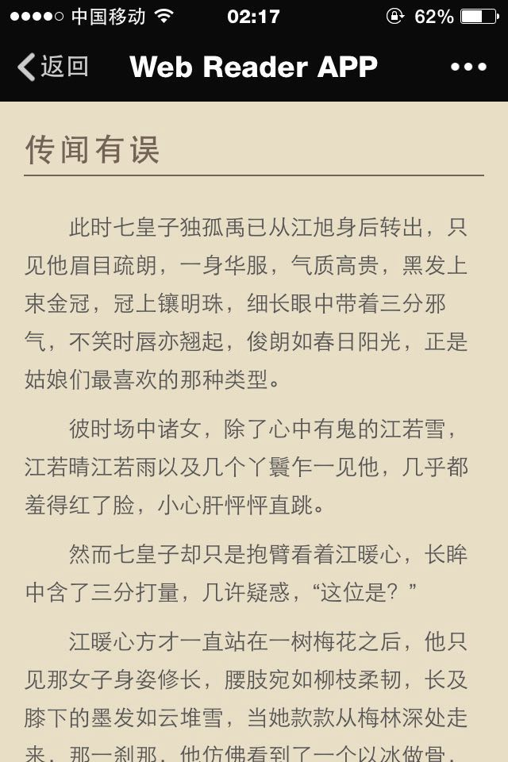
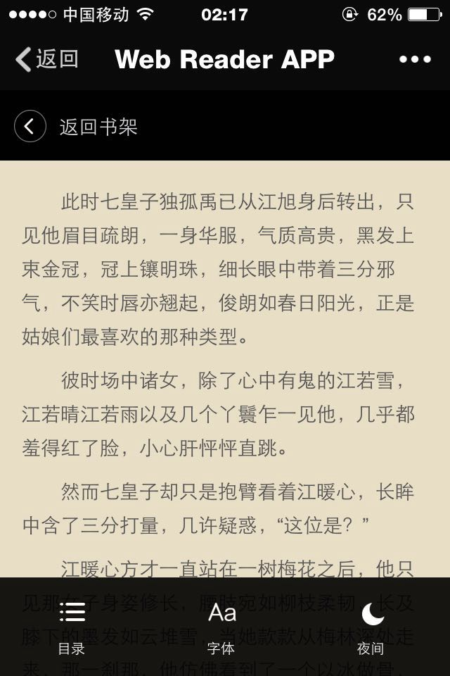
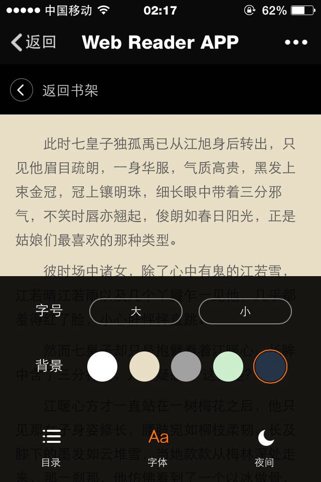
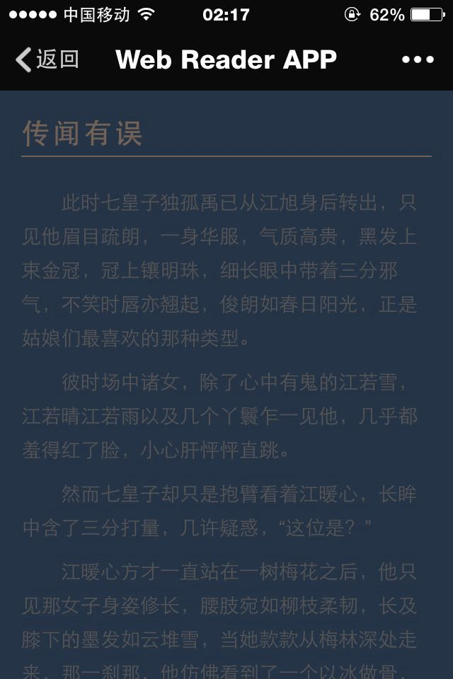
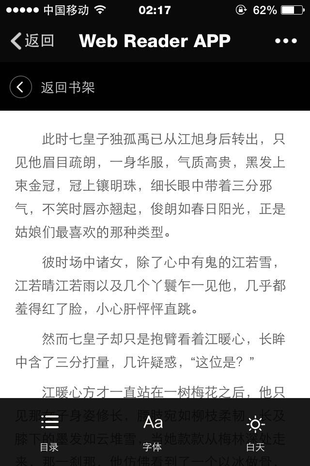

# Web-Read-APP
A HTML5 Moblie Read APP

## Installation
1. git clone <code>https://github.com/huruji/Web-Read-APP</code>
2. <code>browser-sync start --server </code>
3. view localhost:3000 in your browser

## Usage

